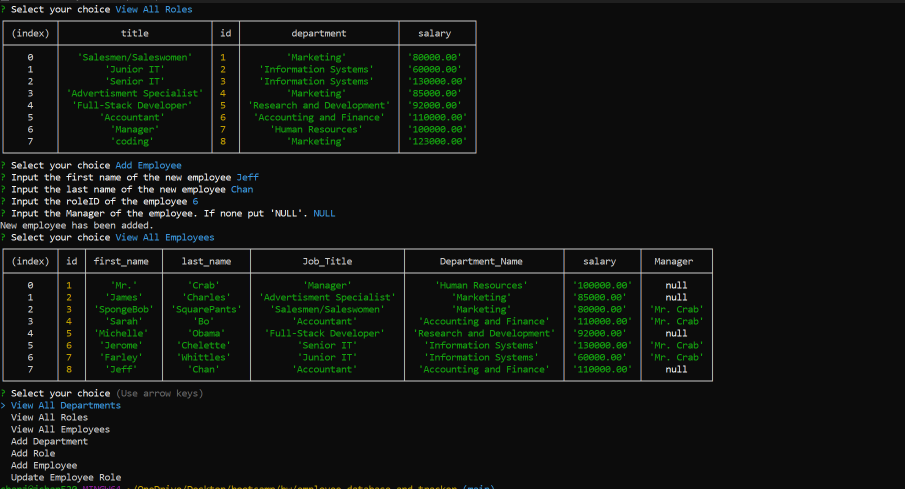

# __Employee-Database-and-Tracker__

## Link to video

[Click Here!](https://drive.google.com/file/d/1Bu_Y8mYvv5tn30r7jW2rD0po6waM0xI0/view)

## Technology

- JavaScript: Programming Language used
- Node.js: To run JavaScript without the browser
- npm: To install necessary modules and packages for this project
- mySql: for the backend, used to create, read and update database
- inquirer: To make forms on the terminal;
- Git: For version control to track changes to source code
- GitHub: To host the repository

## Description

The Employee database and tracker uses mySql to Create, Read, Update, and Delete(CRUD) employee information. We use this information to keep track of each employee involvment in their deployment and roles.

## Table of Contents

If your README is long, add a table of contents to make it easy for users to find what they need.

- [Installation](#installation)
- [Usage](#usage)
- [Credits](#credits)
- [License](#license)
- [Code Snippets](#code-snippets)
- [Author](#author-links)


## Installation

  Dependencies needed: npm, inquirer, mysql2, node.js<br>
  Installation : (only follow this installation if this application was downloaded from GitHub)
   - install node.js via (https://nodejs.org/en/download/)
   - In the terminal, do 'npm install' package.json file. Make sure to do this within the directory with index.js.
   - Lastly install inquirer and mysql by 'npm i express' and 'npm i mysql2'. Again, do this within the directory with index.js

## Usage

Instuctions <br>

Getting Started:
1) Type into the terminal your mysql creditials by "mysql -u root -p"
2) Enter your password
3) Type "source ./db/schema.sql;" to build the database
4) Type "source ./db/seeds.sql;" to fill the tables
<br>

Starting the Program:
1) Remember to install all dependencies from the installation section
2) Type "npm start" to start the program
3) Select the files and fill in the fields .
<br>





## Credits

N/A

## License

N/A

## Code Snippets

```js
//view all emloyees
function viewAllEmployees(){
    const sql = `SELECT employee.id, employee.first_name, employee.last_name, role.title AS Job_Title, department.name As Department_Name, role.salary, CONCAT(manager.first_name, ' ', manager.last_name) AS Manager
                FROM employee
                LEFT JOIN role ON employee.role_id = role.id
                LEFT JOIN department ON role.department_id = department.id
                LEFT JOIN employee manager ON employee.manager_id = manager.id
                ;`;
    db.query(sql, (err,res) =>{
        if(err) throw err;
        console.table(res);
        initalPrompt();
    });
};

```

The code above displays All of the employees on to the terminal screen. I decided to make an variable for sql statement from the lenght of the statment. 


```js
//add department
function addDepartment(){
    inquirer.prompt([
        {
            type: "input",
            message: "Input a new Department",
            name: "newDepartment",
        }
    ]).then( (res) => {
        const sql = 'INSERT INTO department(name) VALUES (?)';
        db.query(sql, res.newDepartment, (err,res) => {
        if (err){
            console.log("New Department was not added.")
            throw err;
        }
        console.log("New department have been added.");
        initalPrompt();
        });
    });

}

```

This function adds a new department into our database. First we use inquirer to get the information need to build a new row, then  we query the information to add an new department.

## Author Links

  You can reach me on
  GitHub: [__chanjeff520__](https://github.com/chanjeff520) <br>
  LinkedIn: [__Jeff chan__](https://www.linkedin.com/in/jefflchan/),<br>
  Email:  __chanjeff520@gmail.com__